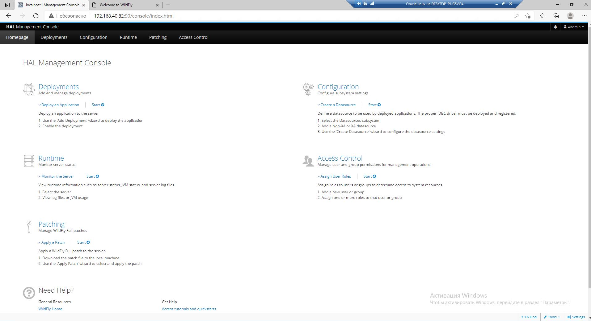

Вот такой конфиг у меня получился:
<pre><code>http {
 server {
   listen 80;
   listen [::]:80;

   server_name 192.168.40.82;

   location / {
       proxy_pass http://127.0.0.1:8080/;
       proxy_set_header Host $host;
   }
 }
 server {
   listen 90;
   listen [::]:90;

   server_name 192.168.40.82;

   location / {
       proxy_pass http://127.0.0.1:9990/;
       proxy_set_header X-Forwarded-For $proxy_add_x_forwarded_for;
       proxy_set_header Host $server_addr:$server_port;
       proxy_set_header X-Real-IP $remote_addr;
   }
 }
}</code></pre>

